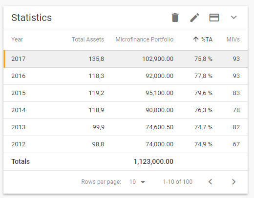

# SymDataTable

> A Data Table component according to Material Design.

## Design Guidelines

The `sym-data-table` is using Material Design guidelines with a slightly change related to selection of rows, which can be customized with CSS.



## Usage

In order to start to use the data table you need to install the npm package as following:

```bash
# install the package
npm install --save sym-components
```

### Javascript

Then in ES06 you have to import and declare your component as following:

```javascript
// import the component from the library
import SymDataTable from 'sym-components'

// declare the component in your Vue file
export default {
  name: 'app',
  components: {
      SymDataTable
  }
}
```

### Typescript

In Typescript you have to import and declare your component as following:

```typescript
// import the component from the library
import { SymDataTable } from 'sym-components'


// declare the component in your Vue file
@Component({
    components: { 
        SymDataTable
    }
})
```

Then you can start to use the declarative approach to create a new instance of it:

```html
<sym-data-table
    title="Table title"
    :items="myItems"
    :isCard="true"
    :columns="myColumns">
</sym-data-table>
```

## Properties

`sym-data-table` provide a set of properties that can be used to configure it at declaration time but also during run-time.

| Name   | Type   | Required   | Default   | Description   |
|:---   |:---   |:---   |:---   |:---   |
| **title**   | `String`   | `true`   | `sym-data-table`   | The Title displayed by the Table   |
| **multiSelect**   | `Boolean`   | `false`   | `false`   | Provides multi-select behaviour   |
| **isCard**   | `Boolean`   | `false`   | `false`   | When true, display a Material Design Card with shadowing and 16 px padding   |
| **collapsible**   | `Boolean`   | `false`   | `false`   | When true, display a chevron on the right top of the table, which allows to collapse/expand the table content   |
| **hasFooter**   | `Boolean`   | `false`   | `false`   | When true, display a footer `tfoot` containing custom totals and a custom label   |
| **footerLabel**   | `String`   | `false`   | `Totals`   | The Title displayed in the footer (*it takes two col-span*)   |
| **items**   | `Array`   | `true`   | `empty`   | The collection of items to be displayed   |
| **columns**   | `Array`   | `false`   | `empty`   | The columns configuration (*see columns configuration section*), if empty it will auto-create the columns   |
| **actions**   | `Array`   | `false`   | `empty`   | A list of Actions that can be displayed on the table header   |

### Columns Configuration

Each Column of the `sym-data-table` can be configured according to the following schema:

```javascript
{
    name: 'total',
    type: 'currency',
    label: 'Total Amount',
    width: 150,
    hasTotal: true,
    format: (val, item) => {  }
}
```

And these are the available options:

| Name   | Type   | Required   | Description   |
|:---   |:---   |:---   |:---   |
| **name**   | `String`   | `true`   | The Name of the Property to be data-bound   |
| **type**   | `String`   | `true`   | The type of data (*string, number, currency, date, time, boolean*)   |
| **label**   | `String`   | `true`   | The Text used in the Column Header   |
| **width**   | `String`-`Int32`  | `true`   | The width in pixels, use `flex` for auto-expand   |
| **hasTotal**   | `Boolean`  | `false`   | When `true` and `hasFooter` is also `true`, it will calculate a total fr the column using `float(2)`   |
| **format**   | `Function`  | `false`   | Provides a function with two parameters `val` which is the current value and *optional* `item` which contains the entire row. **It must return a formatted value**  |

> The function `format` returns two parameters:
> - `val` which contains the raw value of the column
> - `item` which contains the full raw of elements *[optional]*
> You can for example do an inline format of your column using this approach:

```javascript
{
    name: 'hour_fee',
    type: 'currency',
    width: 150,
    label: 'Hour fee',
    hasTotal: true,
    format: function (val) { 
        return new Intl
        .NumberFormat('en-US', {
            style: 'currency', currency: 'EUR'
        }).format(val) 
    }
}                
```

### Actions Configuration

Each Action of the `sym-data-table` can be represented with a [Material Icons icon](https://material.io/icons/):

```javascript
{
    name: 'add',
    icon: 'add',
    disabled: true
}
```

And these are the available options:

| Name   | Type   | Required   | Description   |
|:---   |:---   |:---   |:---   |
| **name**   | `String`   | `true`   | The Name of the Action   |
| **icon**   | `String`   | `true`   | The Material Design icon name   |
| **disabled**   | `Boolean`   | `false`   | Enable/Disable the Action when the component is mounted   |

> If you want to enable/disable an Action at runtime, simply modify the Array item used to populate your Actions, as following:

```javascript
/* disable the action if no rows are selected */
selectionChanged: function (rows) {
    Vue.set(this.actions[0], 'disabled', rows.length < 1)
}
```

## Events

`sym-data-table` also raises events according to the standard Vue.js architecture.

### selected-rows-changed

> It is triggered every time a rows selection happens.
It is also triggered when a row is de-selected.

#### Implementation

```javascript
this.$emit('selected-rows-changed', [array of selected rows])
```
### action-triggered

> It is triggered every time an action in the action bar is triggered.

#### Implementation

```javascript
this.$emit('action-triggered', [an action [name, icon, enabled]]])
```
